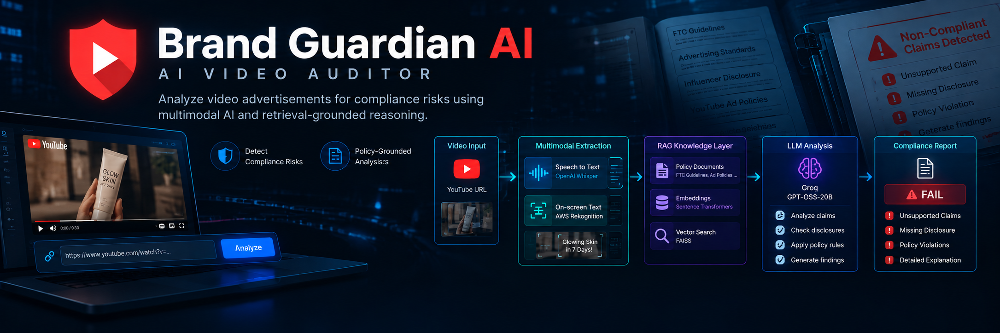
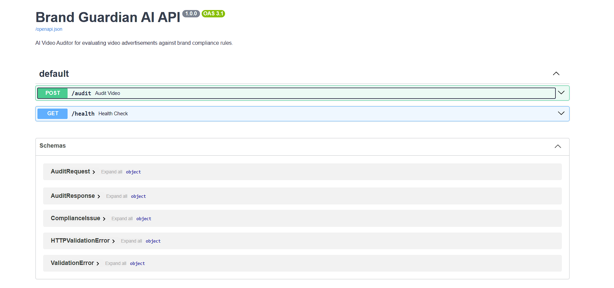
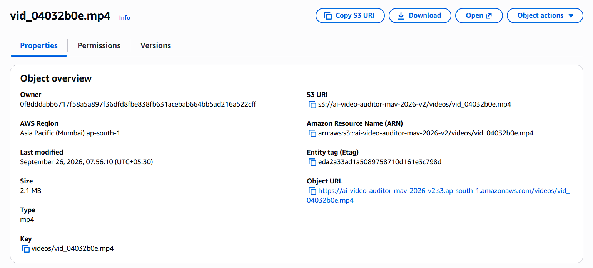
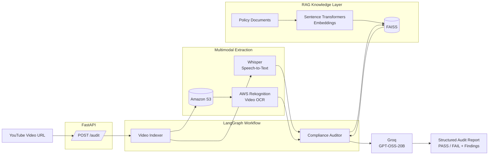
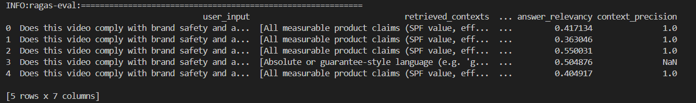

<h1>
   Brand Guardian AI 
</h1>

> An agentic AI video auditor system that analyzes video advertisements for compliance risks by combining video understanding, speech transcription, OCR, policy retrieval, and LLM-based reasoning.

<p align="center">
  
  
  
  
  
  
</p>

<p align="center">
  
  
  
  
  
</p>

<p align="center">
  
  
  
</p>

> **Current version:** `v1.0.0`

--- 

### Demo Video Walkthrough

A short walkthrough shows the complete flow from submitting a YouTube URL to receiving the structured compliance report, followed by the LangSmith execution trace.

- **Watch the demo:** [https://www.youtube.com/watch?v=1xkJx8qgp2o](https://www.youtube.com/watch?v=1xkJx8qgp2o) ~ 2 min

---



---

## The Problem

Video advertisements can contain compliance-relevant information across multiple modalities: **spoken claims, on-screen text, and visual
presentation**. Manually reviewing these elements against advertising policies is time-consuming and can make consistent first-pass screening difficult. 

## The Solution: Brand Guardian AI

**Brand Guardian AI** automates that initial review by extracting multimodal evidence from a video, retrieving relevant policy context, and using an LLM to produce an explainable compliance audit. 
It is designed as an **AI-assisted screening system**, not a substitute for legal review.

---

## Overview

A user provides a **YouTube video URL**. The system then:

1.  Downloads and processes the video.
2.  Extracts spoken content using **OpenAI Whisper**.
3.  Detects on-screen text using **AWS Rekognition Video**.
4.  Retrieves relevant compliance rules from a local **FAISS** knowledge base.
5.  Passes the extracted evidence and retrieved policy context to a **Groq-hosted LLM**.
6.  Produces a structured **PASS / FAIL compliance decision** with categorized findings and explanations.
7.  Exposes the workflow through both a **FastAPI REST API** and a command-line interface.

The architecture is deliberately modular: 
video ingestion, retrieval, orchestration, and compliance reasoning are isolated 
so individual components can be replaced without redesigning the entire pipeline.

---

## Engineering Evidence

The following artifacts show the implemented system running across its API, AI workflow, and cloud storage layers.

### API - FastAPI / Swagger

The swagger interface exposes the health check and video-audit endpoints used to access the pipeline programmatically.



### AI Observability - LangSmith

LangSmith traces make the LangGraph execution path inspectable, including the indexing, auditing, and LLM stages.


### Cloud Infrastructure - Amazon S3

Processed video assets are uploaded to the configured S3 bucket before AWS Rekognition Video performs asynchronous text detection.



---

## Architecture



The application is organized around a small **LangGraph state machine**:

``` text
      START
       │
       ▼
┌──────────────┐
│   Indexer    │
└──────┬───────┘
       │
       │ transcript + OCR + metadata
       ▼
┌──────────────┐
│   Auditor    │
└──────┬───────┘
       │
       ▼
      END
```

### 1. Indexer Node

The indexer handles multimodal video ingestion.

**Responsibilities:**

- Validate the YouTube URL.
- Download the video using `yt-dlp`.
- Transcribe speech locally with Whisper.
- Upload the video to Amazon S3.
- Start AWS Rekognition Video text detection.
- Poll the Rekognition job until completion.
- Collect paginated OCR results.
- Normalize OCR text and video metadata.
- Clean up the temporary local video file.

The result is a normalized state containing:

``` text
Transcript,
OCR text,
Video metadata,
Processing status,
Errors
```

### 2. Compliance Auditor Node

The auditor combines extracted video evidence with policy knowledge.

**Flow:**

``` text
Transcript + OCR
       │
       ▼
Query construction
       │
       ▼
FAISS similarity search
       │
       ▼
Top-k policy chunks
       │
       ▼
Groq LLM
       │
       ▼
Structured JSON
       │
       ▼
PASS / FAIL + findings
```

The LLM is instructed to return structured compliance findings rather than unrestricted prose.

---

## Retrieval-Augmented Generation

The compliance knowledge base is stored locally as a **FAISS vector index**.

Current source documents include:
- FTC influencer / endorsement guidance
- YouTube advertising specifications

Documents are processed into embeddings using:

``` text
sentence-transformers/all-MiniLM-L6-v2
```

At audit time:

``` text
Video evidence
     │
     ▼
Semantic query
     │
     ▼
FAISS similarity search
     │
     ▼
Top 4 relevant policy chunks
     │
     ▼
LLM compliance reasoning
```

This makes the compliance decision **retrieval-grounded** rather than relying solely on the model's pretrained knowledge.

---

## Multimodal Evidence Pipeline

Brand Guardian AI does not rely on a single input channel.

It combines:

| Evidence source  | Technology         | Purpose                                         |
|------------------|--------------------|-------------------------------------------------|
| Spoken dialogue  | OpenAI Whisper     | Extract spoken claims and disclosures           |
| On-screen text   | AWS Rekognition    | Detect captions, claims, labels and disclosures |
| Video metadata   | AWS Rekognition    | Duration and processing metadata                |
| Policy knowledge | FAISS + embeddings | Retrieve relevant compliance rules              |
| Reasoning        | Groq / GPT-OSS-20B | Evaluate evidence against retrieved rules       |

This allows the auditor to reason over both **what is said** and **what appears on screen**.

---

## Example Audit Result

A simplified audit response looks like:

``` json
{
  "status": "FAIL",
  "compliance_results": [
    {
      "category": "Claim Validation",
      "severity": "CRITICAL",
      "description": "Performance claims require supporting substantiation...."
    },
    {
      "category": "Disclosure",
      "severity": "CRITICAL",
      "description": "A sponsorship relationship is implied without an appropriate disclosure...."
    }
  ],
  "final_report": "The advertisement contains compliance risks related to unsupported performance claims and missing disclosure."
}
```

The actual response is generated dynamically by the compliance workflow and may vary between runs because LLM-based reasoning is not
deterministic.

---

## Technology Stack

| Layer                  | Technology                  |
|------------------------|-----------------------------|
| Language               | Python 3.11                |
| Workflow orchestration | LangGraph                   |
| API                    | FastAPI + Pydantic          |
| Video download         | yt-dlp                      |
| Speech recognition     | OpenAI Whisper              |
| Video storage          | Amazon S3                   |
| OCR                    | AWS Rekognition Video       |
| Embeddings             | Sentence Transformers       |
| Vector database        | FAISS                       |
| Retrieval              | LangChain                   |
| LLM                    | Groq - `openai/gpt-oss-20b` |
| Observability          | LangSmith                   |
| Evaluation             | RAGAS                       |
| Containerization       | Docker                      |
| Testing                | Pytest                      |
| CI                     | GitHub Actions              |

---

## Project Structure

``` text
brand-guardian-ai/
├── assets/
│   ├── screenshots/
│
├── backend/
│   ├── data/
│   │   ├── *.pdf
│   │   └── faiss_index/
│   │
│   ├── scripts/
│   │   └── index_documents.py
│   │
│   └── src/
│       ├── api/
│       │   └── server.py
│       │
│       ├── graph/
│       │   ├── nodes.py
│       │   ├── state.py
│       │   └── workflow.py
│       │
│       └── services/
│           ├── retriever.py
│           └── video_indexer.py
│
├── eval/
│   ├── eval_dataset.json
│   ├── eval_ragas.py
│   └── ragas_results.json
│
├── tests/
│   ├── test_api.py
│   ├── test_nodes.py
│   ├── test_retriever.py
│   ├── test_video_indexer.py
│   └── test_workflow.py
│
├── main.py
├── Dockerfile
├── .gitignore
├── .python-version
├── LICENSE
├── pyproject.toml
├── requirements.txt
├── requirements-dev.txt
├── requirements-eval.txt
├── uv.lock
└── README.md

```

---

## Getting Started

### Prerequisites

- Python 3.11+
- `ffmpeg`
- AWS account with:
  - S3 access
  - Rekognition Video access
- Groq API key
- Git
- Docker (optional)

AWS S3 and Rekognition should use the same supported AWS region. The current implementation uses `ap-south-1`(Mumbai) by default.

---

## Installation

Clone the repository:

``` bash
git clone https://github.com/Abhishek-369V/brand-guardian-ai.git
cd brand-guardian-ai
```

Create a virtual environment:

### Windows

``` powershell
python -m venv .venv
.venv\Scripts\activate
```

### Linux / macOS

``` bash
python3 -m venv .venv
source .venv/bin/activate
```

Install dependencies:

``` bash
pip install -r requirements.txt
```

For CPU-only Whisper/PyTorch environments, install the appropriate CPU PyTorch build before installing the remaining requirements if required by your environment.

---

## Environment Configuration

Create a `.env` file in the project root.

Example:

``` env
AWS_ACCESS_KEY_ID=your_access_key
AWS_SECRET_ACCESS_KEY=your_secret_key
AWS_DEFAULT_REGION=ap-south-1
AWS_S3_BUCKET_NAME=your_bucket_name

GROQ_API_KEY=your_groq_api_key

LANGCHAIN_TRACING_V2=true
LANGCHAIN_API_KEY=your_langsmith_api_key
LANGCHAIN_PROJECT=brand-guardian-ai
```

Never commit real credentials.

---

## Build the Knowledge Base

The policy documents are stored under:

``` text
backend/data/
```

Build the FAISS index:

``` bash
python backend/scripts/index_documents.py
```

The generated index is stored under:

``` text
backend/data/faiss_index/
```

---

## Running the Application

## FastAPI

Start the API:

``` bash
uvicorn backend.src.api.server:app --reload
```

API documentation:

``` text
http://localhost:8000/docs
```

Health check:

``` http
GET /health
```

Audit endpoint:

``` http
POST /audit
```

Example request:

``` bash
curl -X POST http://localhost:8000/audit -H "Content-Type: application/json" -d "{\"video_url\":\"https://youtu.be/<video-id>\"}"
```

---

## CLI

The complete workflow can also be executed without FastAPI:

``` bash
python -m main "https://youtu.be/<video-id>"
```

The CLI prints:

- Video/session information
- PASS / FAIL status
- Detected compliance issues
- Severity
- Final audit summary

---

## Docker

Build the container:

``` bash
docker build -t brand-guardian-ai .
```

Run:

``` bash
docker run -p 8000:8000 --env-file .env brand-guardian-ai
```

Then open:

``` text
http://localhost:8000/docs
```

The Docker image packages the FastAPI application and required runtime environment, including the system dependencies required for Whisper audio extraction.

---

## Testing

The project includes unit and integration-style tests covering the major
pipeline components.

Run:

``` bash
pip install -r requirements-dev.txt
python -m pytest tests/ -v
```

Current suite:

``` text
20 tests
20 passed
```

### Coverage includes

**API**

- Health endpoint
- Successful audit request
- Workflow failure handling
- Request validation

**LangGraph nodes**

- Successful video audit
- Markdown-fenced JSON parsing
- Invalid LLM JSON handling
- Missing-transcript handling
- YouTube URL validation
- Temporary-file cleanup
- Failure-path cleanup

**Retriever**

- Successful retrieval
- Missing source metadata fallback

**Video indexing service**

- File-extension handling
- Rekognition pagination
- Failed Rekognition jobs
- OCR deduplication
- Duration conversion
- Missing AWS configuration

**Workflow**

- Indexer → Auditor execution
- Skipping the audit stage when indexing fails

External services and expensive model operations are mocked in tests so
the test suite can run without consuming AWS/Groq resources.

---

## Evaluation

The project includes an evaluation harness using **RAGAS**.



Run:

``` bash
pip install -r requirements-eval.txt
python -m eval.eval_ragas
```

Results are written to:

``` text
eval/ragas_results.json
```

## Current benchmark

The current evaluation contains **5 scenarios**:

- 1 production-derived pipeline example
- 4 synthetic compliance scenarios

Current observed metrics:

| Metric            |          Result |
|-------------------|----------------:|
| Faithfulness      |     mean ≈ 0.23 |
| Answer relevancy  |     mean ≈ 0.45 |
| Context precision | 1.0 on 4/5 rows |

### Interpreting the benchmark

These numbers should **not** be treated as production-quality model metrics.

The benchmark is intentionally small and currently serves primarily to validate the evaluation pipeline.

Important limitations:

- The dataset contains only 5 samples.
- Only 1 sample comes from a real pipeline execution.
- The remaining scenarios use manually constructed inputs and reference answers.
- LLM-as-a-judge metrics can vary between runs.
- Compliance reasoning can involve legitimate inference from retrieved rules, which strict statement-level faithfulness metrics may penalize.

The evaluation harness is therefore treated as an engineering measurement tool rather than evidence of production compliance accuracy.

---

## Performance

The current implementation has been validated end-to-end using a 30-second YouTube video on a CPU-based local environment.

### Observed Run (langSmith Trace)

The latest recorded end-to-end run completed in approximately **70 seconds**:

- End-to-end: ~70 seconds
- Indexing: ~51 seconds
- Auditor: ~18 seconds
- LLM call: ~2.6 seconds
- LLM input: 846 tokens
- LLM output: 1.612K tokens
- Total LLM tokens: 2.458K
- LLM cost: ~$0.0005

These measurements are workload and environment-specific and should not be interpreted as guaranteed latency or cost for all videos or workloads.

### Long-video considerations

The application does not impose a hard-coded video-duration limit. However, long-video scalability has not yet been benchmarked.

The current architecture:

- Processes Whisper transcription locally.
- Uploads the complete video to S3.
- Uses asynchronous Rekognition processing.
- Collects paginated OCR results.
- Passes the combined transcript and OCR evidence to the auditor in a single LLM request.
- Processes `/audit` synchronously.

For substantially longer videos or higher throughput, the next architectural improvements would be:
1. transcript chunking
2. hierarchical summarization
3. evidence-level retrieval
4. asynchronous job processing, and 
5. workload-aware resource management.

Long-video benchmarking was intentionally not performed because longer workloads increase local compute time, AWS processing/storage usage, and LLM inference costs.

---

## Engineering Decisions

## 1. Why LangGraph?

The pipeline contains multiple stateful processing stages:

``` text
Video
 ↓
Transcript + OCR
 ↓
Policy retrieval
 ↓
Compliance reasoning
 ↓
Structured result
```

LangGraph provides an explicit state-machine abstraction for these steps and makes the workflow easier to extend with additional nodes, branching logic, retries, or human-review stages.

---

## 2. Why RAG instead of relying only on the LLM?

Compliance decisions should be grounded in the policy material available to the system.

The retrieval layer provides the model with relevant policy passages at inference time:

``` text
Video evidence
      +
Retrieved policy
      ↓
LLM reasoning
```

This reduces reliance on the model's pretrained knowledge and makes the source material used for a decision inspectable.

---

## 3. Why FAISS?

The current knowledge base is relatively small and local.

FAISS provides:

- Fast similarity search
- Local execution
- No external vector database dependency
- Simple reproducible indexing
- Easy development and testing

A managed vector database could be introduced if the knowledge base grows significantly.

---

## 4. Why Whisper?

The initial architecture considered a managed transcription service, but local Whisper provides:

- Local speech-to-text processing
- No per-minute transcription API dependency
- A simple provider boundary
- Better portability during development

The transcription implementation is isolated inside the video indexing service, making future provider replacement straightforward.

---

## 5. Why Groq?

The LLM layer is isolated inside the auditor node.

This allows the reasoning provider to be replaced without redesigning the ingestion or retrieval pipeline.

The current implementation uses:

``` text
Groq
└── openai/gpt-oss-20b
```

with deterministic generation settings:

``` text
temperature = 0
```

---

## Reliability & Failure Handling

The pipeline explicitly handles several failure conditions.

Examples include:

``` text
Invalid YouTube URL
        ↓
Indexer failure
        ↓
Audit skipped
```

and:

``` text
Whisper failure
        ↓
FAIL state
        ↓
Temporary video cleanup
```

and:

``` text
Malformed LLM JSON
        ↓
Auditor failure
        ↓
Structured FAIL response
```

Temporary downloaded videos are cleaned up even when the processing pipeline raises an exception.

---

## Security Considerations

The current project is an engineering prototype rather than a production SaaS deployment.

Current considerations include:

- API credentials are supplied through environment variables.
- Secrets are excluded from version control.
- The API currently has no authentication layer.
- Uploaded videos remain in the configured S3 bucket.
- No automatic S3 lifecycle policy is currently configured.
- The `/audit` endpoint is synchronous.
- No request-level rate limiting is currently implemented.

A production deployment would require: 
- authentication, authorization, request limits, asynchronous job processing, object lifecycle management, stronger secret management, and additional observability.

---

## Current Limitations

The system intentionally has several known limitations.

### Input

- YouTube URLs only.
- `yt-dlp` behavior depends on changes to YouTube's platform.
- Processing is currently designed around individual synchronous requests.

### Knowledge base

- Current policy coverage is limited to the included documents.
- The system does not claim comprehensive coverage of all advertising regulations, platforms, or jurisdictions.

### Speech / OCR

- Whisper transcription can misinterpret brand names or specialized terminology.
- OCR quality depends on video quality, text size, contrast, and presentation.

### LLM reasoning

- LLM output is non-deterministic.
- There is currently no large labelled benchmark for precision/recall.
- Compliance findings should therefore be treated as AI-assisted analysis rather than legal advice.

### Infrastructure

- Rekognition polling currently uses a fixed polling interval.
- The API is synchronous.
- There is no authentication or queue-based job system.
- S3 object lifecycle management is not automated.

---

## Future Enhancements

The current architecture provides a foundation for several practical extensions:

- **Asynchronous processing:** move long-running audits to queued background jobs.
- **Security:** add API authentication, authorization, and request-level rate limiting.
- **Evidence grounding:** strengthen evidence-to-policy attribution and citation-level support for findings.
- **Evaluation:** expand the benchmark with more production-derived and labelled compliance examples.
- **Policy coverage:** support configurable policy collections and additional advertising platforms.
- **Product workflow:** add audit persistence, review history, human review, and exportable reports.
- **Infrastructure:** introduce automated S3 lifecycle management and workload-aware processing for longer videos.

---

## API Reference

Once the server is running, interactive OpenAPI documentation is available at:

``` text
http://localhost:8000/docs
```

### Endpoints

| Method | Endpoint  | Purpose                      |
|--------|-----------|------------------------------|
| `GET`  | `/health` | Service health check         |
| `POST` | `/audit`  | Run a video compliance audit |

Example audit request:

``` json
{
  "video_url": "https://youtu.be/<video-id>"
}
```

Example response shape:

``` json
{
  "session_id": "uuid",
  "video_id": "vid_xxxxxxxx",
  "status": "PASS",
  "final_report": "No compliance violations identified.",
  "compliance_results": []
}
```

---

## Project Pipeline

The core pipeline is implemented end-to-end:

``` text
YouTube
   ↓
Whisper
   ↓
AWS S3
   ↓
AWS Rekognition
   ↓
FAISS Retrieval
   ↓
Groq LLM
   ↓
Structured Compliance Report
   ↓
FastAPI / CLI
```

The repository includes:

- End-to-end LangGraph workflow
- Multimodal video evidence extraction
- Retrieval-Augmented Generation
- Local vector search
- Structured LLM output
- REST API
- CLI interface
- Docker deployment
- Automated tests
- RAGAS evaluation
- CI validation

---

## License

This project is licensed under the MIT License.

---

## Author

**Madanala Abhishek Varma**  

Computer Science & Engineering · AI / ML / Data Science

**LinkedIn:** [linkedin.com/in/madanala-abhishek-varma/](https://www.linkedin.com/in/madanala-abhishek-varma/)  
**Demo:** [Brand Guardian AI - AI Video Auditor](https://www.youtube.com/watch?v=1xkJx8qgp2o)

---

> **Brand Guardian AI - AI-assisted video compliance auditing through multimodal evidence, retrieval-grounded reasoning, and structured AI workflows.**

---

<h3 align="center">
   ⭐ If you found this project useful, consider giving it a Star.
</h3>